# Using Postman to Play with FHIR

This tutorial shows how to use Postman (a browser based REST tool) to take FHIR for a spin.

## Installing Postman

* Open Chrome, and browse to the following URL: [Postman](https://chrome.google.com/webstore/detail/postman/fhbjgbiflinjbdggehcddcbncdddomop?hl=en) 

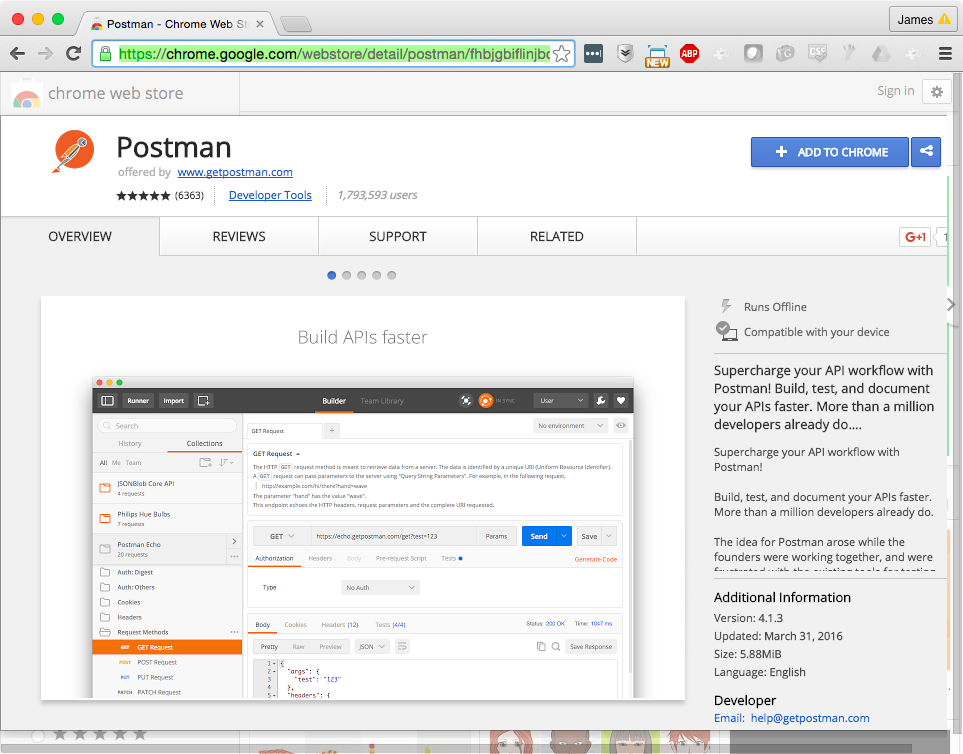

* Open the Postman App
* Either sign in or click "`skip this, go straight to app`"

# Create a Resource

The following example shows how to create a Patient resource by POSTing it to a server. Note that most of the examples below are shown using JSON. If you are more comfortable using XML that's fine! See the notes for what you need to do differently.

## Create a JSON Resource

First, set the method to `POST`, and the URL to `http://fhirtest.uhn.ca/baseDstu2/Patient` as shown in the screenshot below:

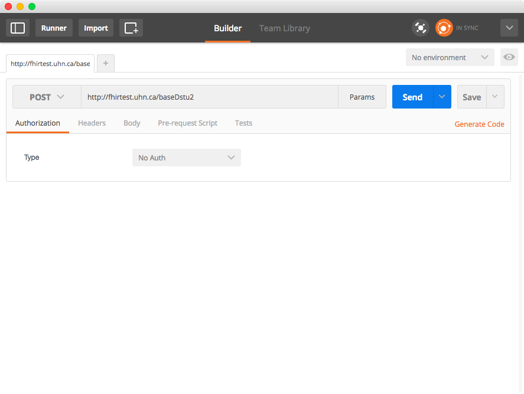

Now, switch to the `Headers` tab, and add a header with a key/name of `Content-Type` and a value of `application/json+fhir` (or for XML, the value should be `application/xml+fhir` )

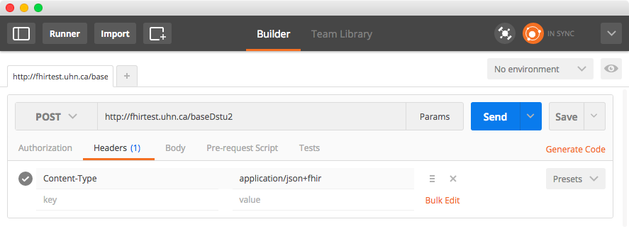

Add the following content, which is a simple Patient resource. Look at the `"name"` section below, and change this to your own name if you would like.

```json
{
  "resourceType": "Patient",
  "identifier": [
    {
      "system": "urn:oid:1.2.36.146.595.217.0.1",
      "value": "12345",
    }
  ],
  "name": [
    {
      "family": [
        "Chalmers"
      ],
      "given": [
        "Peter",
        "James"
      ]
    }
  ],
  "telecom": [
    {
      "system": "phone",
      "value": "(03) 5555 6473",
      "use": "work"
    }
  ]
}
```

If you prefer XML, the content could be:

```xml
<Patient xmlns="http://hl7.org/fhir">
  <identifier>
    <system value="urn:oid:1.2.36.146.595.217.0.1"/>
    <value value="12345"/>
  </identifier>
  <name>
    <family value="Chalmers"/>
    <given value="Peter"/>
    <given value="James"/>
  </name>
  <telecom>
    <system value="phone"/>
    <value value="(03) 5555 6473"/>
    <use value="work"/>
  </telecom>
</Patient>
```

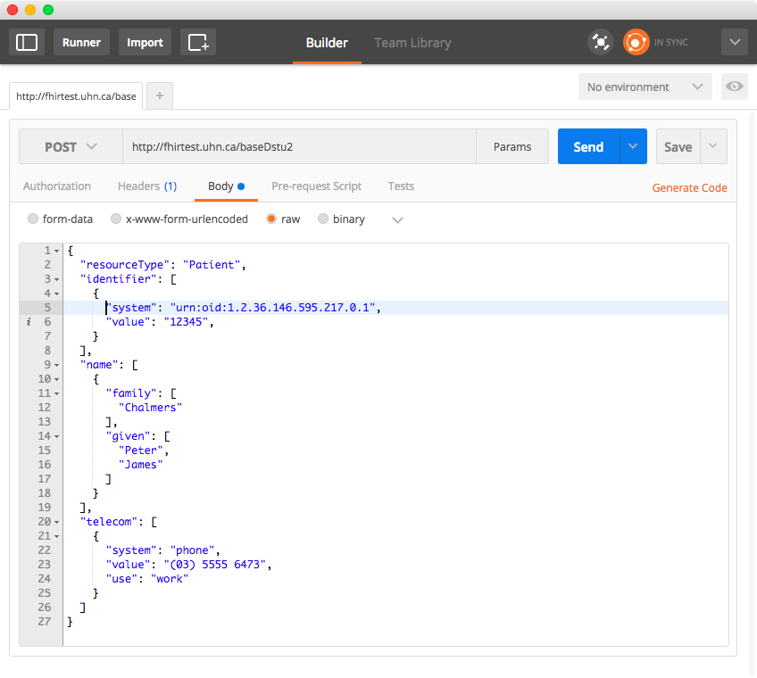

Click `Send` and then scroll to the bottom of the window.

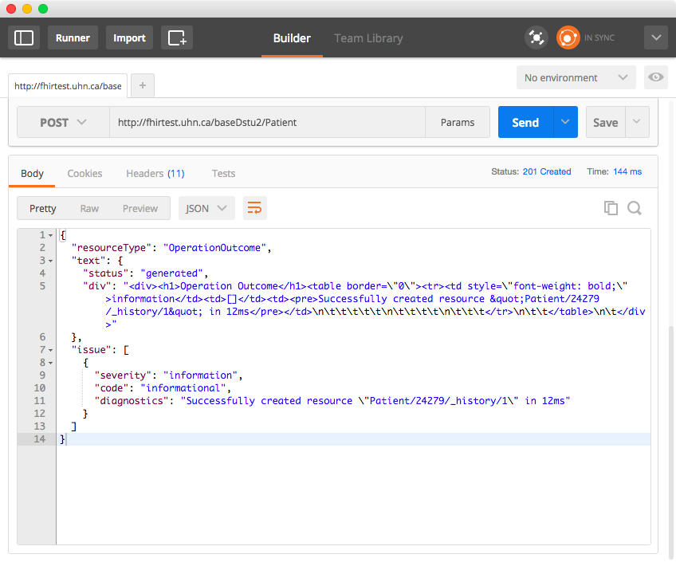

Change to the `Headers` tab to see the response headers.

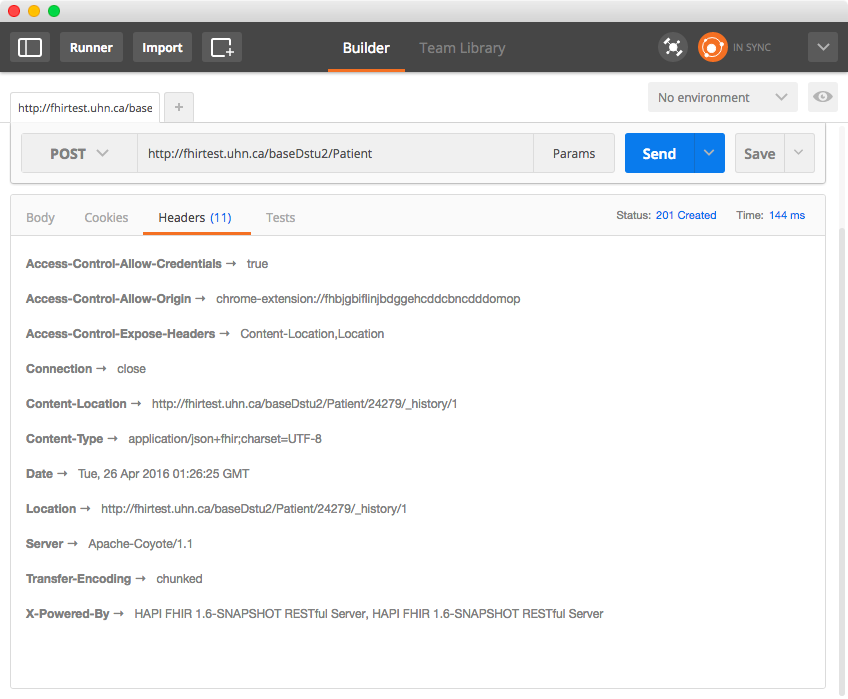

On this tab you will see the `Location` response header, which specifies the URL you can use to retrieve this resource. Try pasting that URL into a browser:


You can try adding `?_format=xml` or `?_format=json` to the URL to specify that you want XML or JSON as response. The server will automatically convert.

## Update the Resource

Note the logical ID of the resource you have added (it's `24279` in the example above, but it will be a different number for the resource you have just created). Return to Postman, and scroll back to the top (request) part of the window. Make the following changes:

* Change the HTTP method (top left part of the window) from `POST` to `PUT`
* Add the logical ID to the URL
* Add the ID to the resource body in a new item right below the `"resourceType"` element, as shown in the example below
* You can also make any other changes you want! Try adding `"gender"`, or `"birthDate"`, or any other fields on the [Patient resource definition](http://hl7.org/fhir/patient.html)

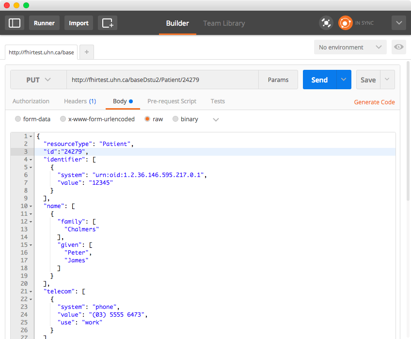

Click `Send` and scroll to the bottom to see the results. If the operation succeeded, you will note that the new version is `/_history/2`

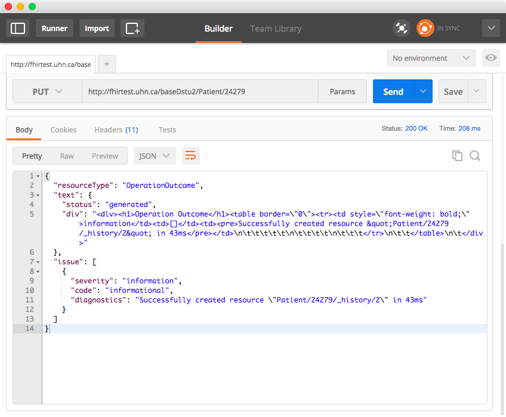

Try looking up the history of changes for your new resource by adding `/_history` to the end of the resource's logical ID and pasting that into a browser. Note that the response is a bundle which contains all versions.

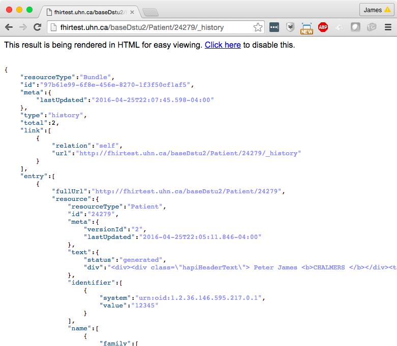

# Search For your Resource

Let's try searching for your resource now. We'll use the HAPI testing UI to build a query, but really we're just creating URLs you could use in Postman or a browser or anything else.

* Point your browser at [http://fhirtest.uhn.ca/](http://fhirtest.uhn.ca/)
* Click on `Patient` on the left hand navigation bar
* Change the `Search Parameters` dropdown box to the `Name` parameter
* Put the name that you gave your resource in

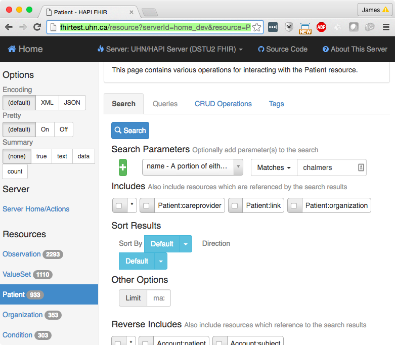

Click search and you will see the results of your search.

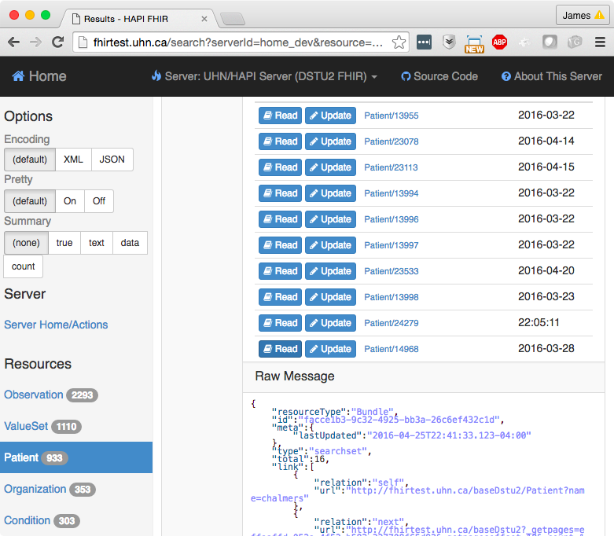
