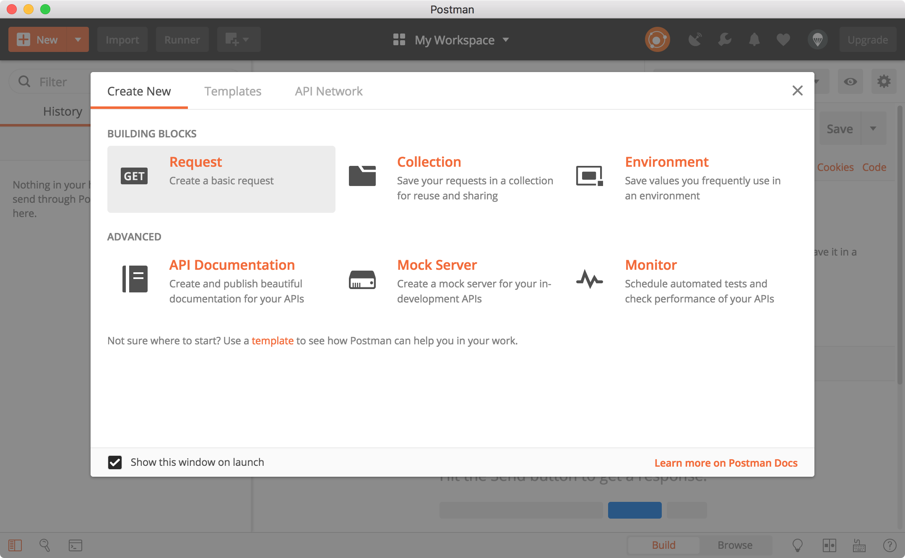
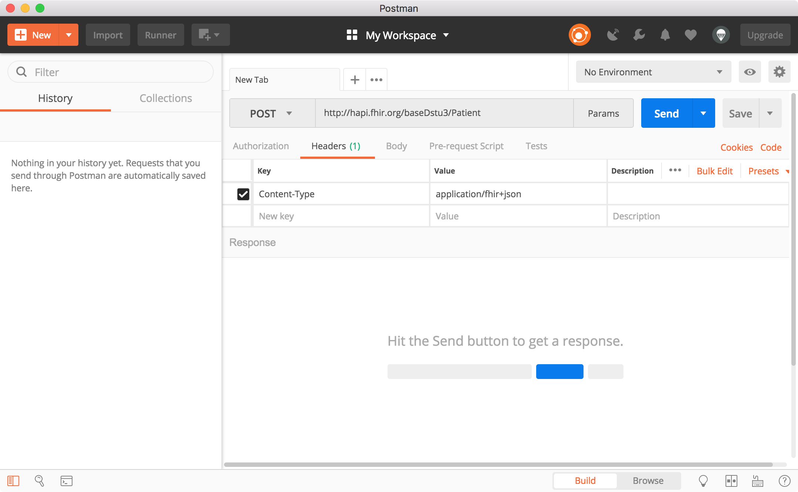
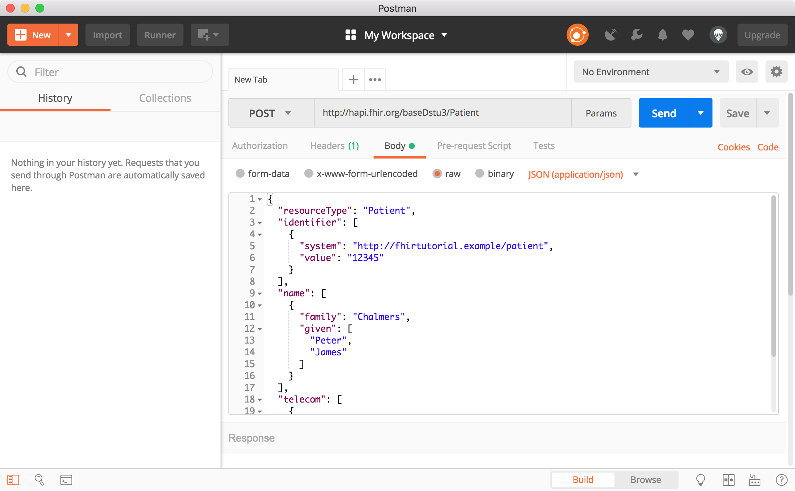
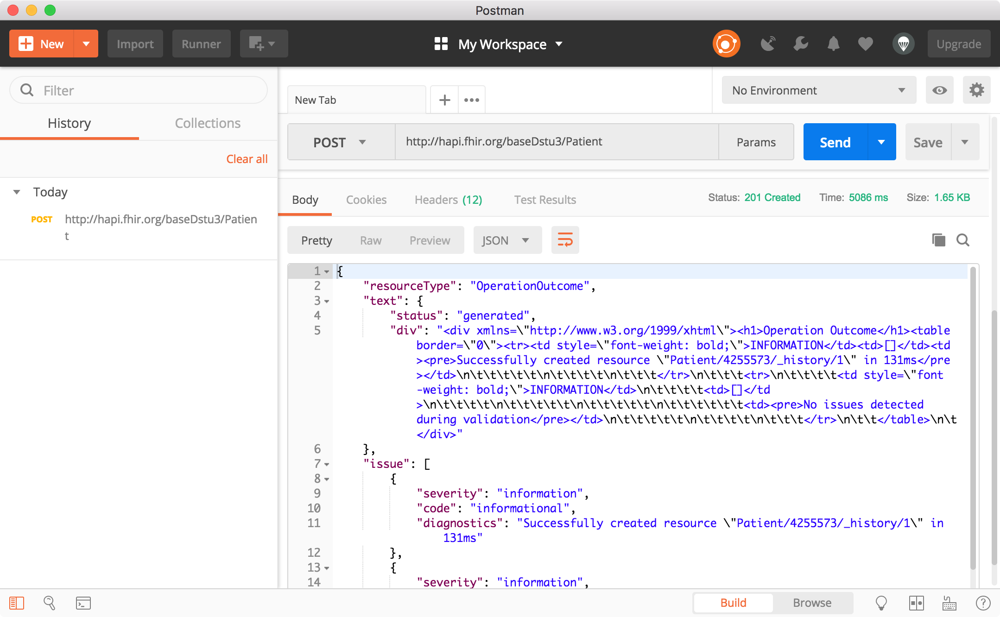
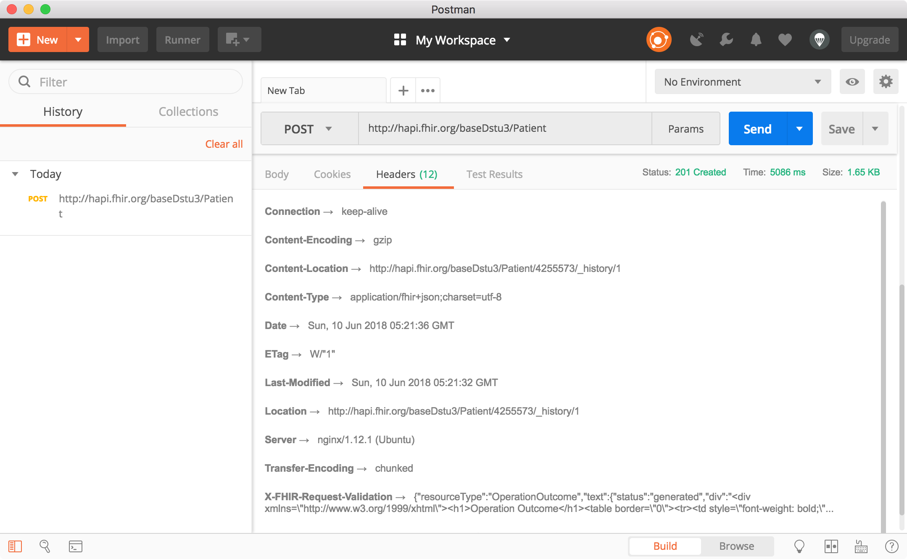
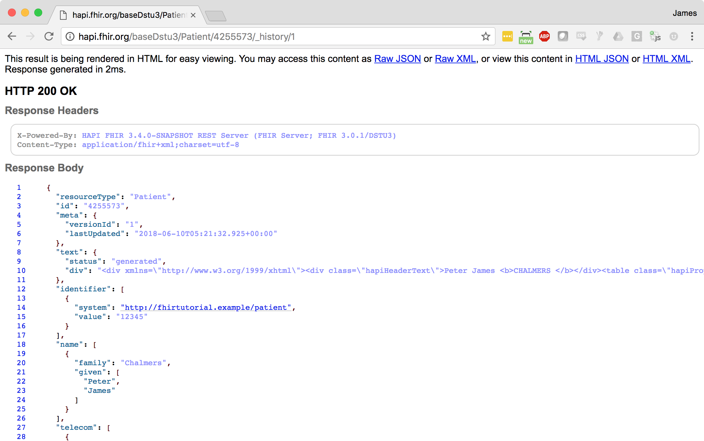
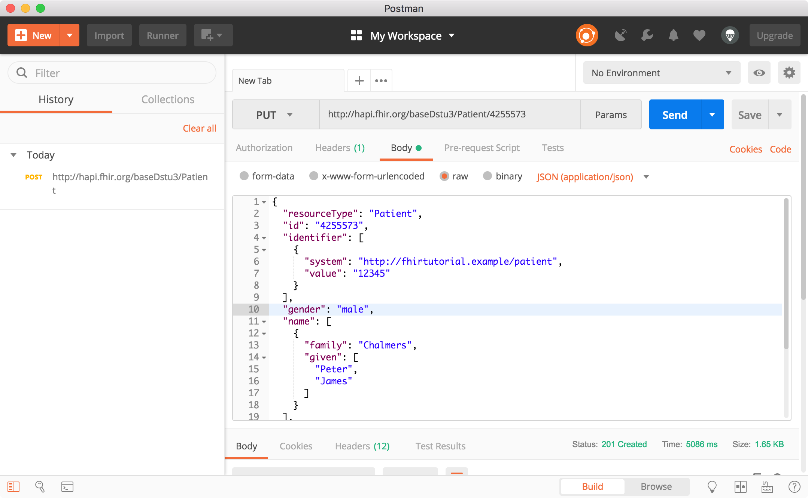
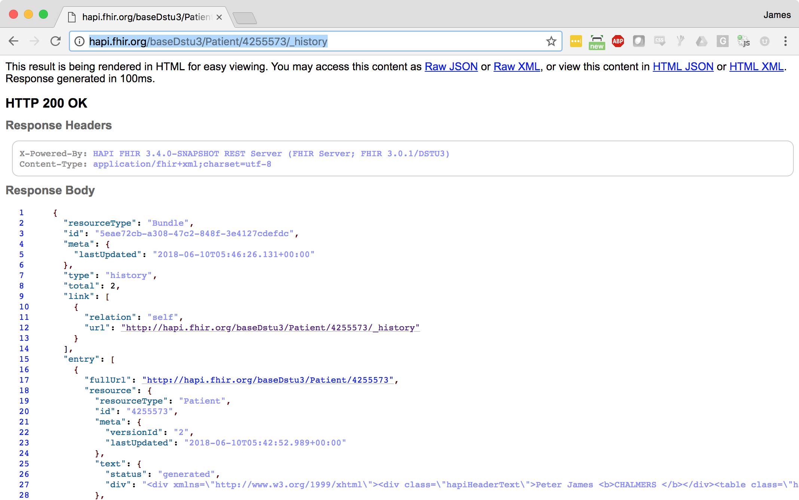

# Using Postman to Play with FHIR

This tutorial shows how to use Postman (a browser based REST tool) to take FHIR for a spin.

## Installing Postman

Install the Postman tool by visiting the following URL: https://www.getpostman.com/apps

On MacOS you can also install using Homebrew:

```
brew install homebrew/cask/postman
```

On Ubuntu you can also install using Snap:

```
snap install postman
```

# Start Postman

Once you launch Postman, you may be prompted with the dialog shown below. Click on the "X" in the top-right corner to dismiss it.

<a href="images/create_new_request.png" style="width:600px;"></a>

# Create a Resource

The following example shows how to create a Patient resource by POSTing it to a server. Note that most of the examples below are shown using JSON. If you are more comfortable using XML that's fine! See the notes for what you need to do differently.

## Create a JSON Resource

First, let's try performing a FHIR [create](http://hl7.org/fhir/http.html#create) operation. We will create a sample resource on a public HAPI FHIR test server. Later we'll retrieve this resource back.

In Postman:

* Set the method to `POST` (the default is `GET`)
* Set the URL to `http://hapi.fhir.org/baseDstu3/Patient`
* Add the following header, telling the server that you are going to be sending it FHIR JSON content:
   * Key: `Content-Type`
   * Value: `application/fhir+json`

The following screenshot shows the settings so far:

<a href="images/create_url_and_header.png"></a>

Next, switch to the **Body** tab, and choose the **Raw** option. This allows you to paste in some resource content.

Optionally, you can also switch the **Text** option (next to the Binary button) to **JSON**. This will give you some nicer syntax highlighting.

Copy and paste the following text in, and modify it so that it is unique for you. You could replace the patient's name with your own name, or even just replace the identifier with a different unique identifier.

```json
{
  "resourceType": "Patient",
  "identifier": [
    {
      "system": "http://fhirtutorial.example/patient",
      "value": "12345"
    }
  ],
  "name": [
    {
      "family": "Chalmers",
      "given": [
        "Peter",
        "James"
      ]
    }
  ],
  "telecom": [
    {
      "system": "phone",
      "value": "(03) 5555 6473",
      "use": "work"
    }
  ]
}
```

The following screenshot shows this request:

<a href="images/create_body.png"></a>

Click `Send` and then scroll to the bottom of the window.

<a href="images/create_response.png"></a>

Change to the `Headers` tab to see the response headers.

<a href="images/create_response_headers.png"></a>

On this tab you will see the `Content-Location` response header, which specifies the URL you can use to retrieve this resource. Try pasting that URL into a browser:

<a href="images/read_browser.png"></a>

You can try adding `?_format=html/xml` or `?_format=html/json` to the URL to specify that you want XML or JSON as response. The server will automatically convert.

## Update the Resource

Next, let's perform a FHIR [update](http://hl7.org/fhir/http.html#update) operation to change the contents of the resource you just created.

Note the logical ID of the resource you have added (it's `4255573` in the example above, but it will be a different number for the resource you have just created). Return to Postman, and scroll back to the top (request) part of the window. Make the following changes:

* Change the HTTP method (top left part of the window) from `POST` to `PUT`
* Add the logical ID to the URL
* Add the ID to the resource body in a new item right below the `"resourceType"` element, as shown in the example below
* You can also make any other changes you want! Try adding `"gender"`, or `"birthDate"`, or any other fields on the [Patient resource definition](http://hl7.org/fhir/patient.html)

<a href="images/update_body.png"></a>

Click `Send` and scroll to the bottom to see the results. If the operation succeeded, you will note that the new version is `/_history/2`

<a href="images/update_result.png"></a>

# Loading Resource History

Next, let's look at the history of the resource over time.

Try entering your resource ID into a browser, with `/_history` at the end of the URL.

<a href="images/history.png"></a>
